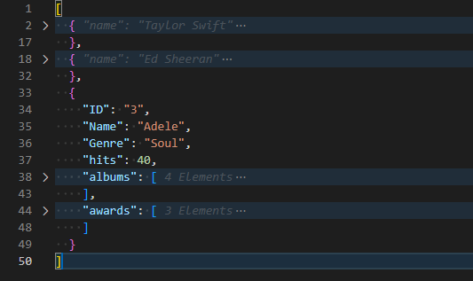
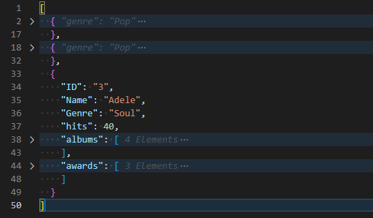
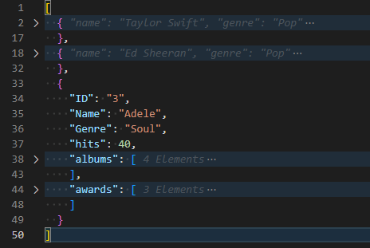
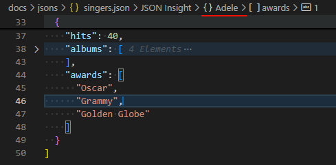
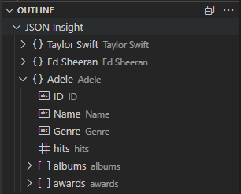

  

  <h1>JSON Insight for VSCode</h1>
  
IntelliJ like JSON annotations tool.

  
Enhance JSON file readability by displaying key name hints for folded objects.

  
  
  
  
  

  

## Features
- JSON Annotations: Automatically display annotations for configured keys in your JSON file.

- Customizable Keys: You can configure which keys and values will appear as annotations.

- Multiple Key-Value Annotations: Supports displaying multiple key-value pairs as annotations for a single JSON object.

- JSON document symbols.

- JSON Explorer.

Peace and love.
